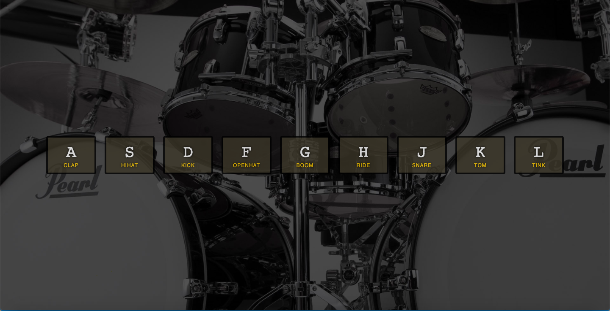

# JavaScript Drum Kit

## Description

This app was challenge one from [Wes Bos](https://javascript30.com/) which uses HTML, CSS, and JS event listeners and key codes.

Going over the challenges to refresh my skills in JS. 
## Installation

1. Clone the repo
2. Right click the index.html file and open in browser

## Usage

Press the keys that are displayed on the screen to hear the audio

[Deployed Site](https://sharonkim09.github.io/JS-Drum-Kit/)

## Credit

Credits to [Wes Bos](https://github.com/wesbos) JS 30Day Challenge

